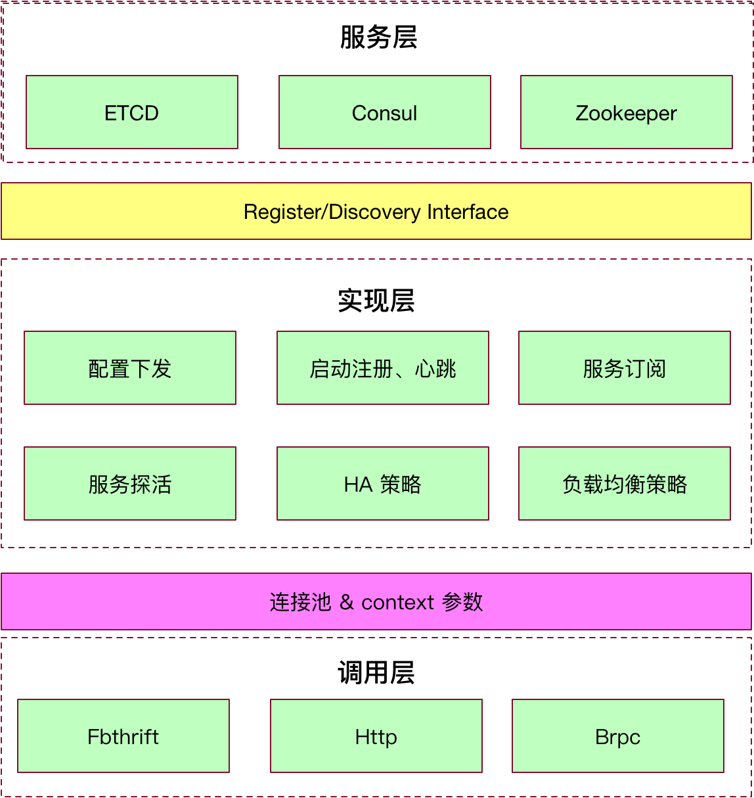

# 背景

在业务系统中根据服务状态，可以分为有状态、无状态两个类型，对于无状态的服务类型类似于计算服务，一个输入一个输出，计算规则永恒。对于有状态的服务类似于存储类型的服务。在众多服务中，服务与服务之间调用错综复杂，并且每个服务的存活状态都会影响下游一些列服务的状态。所以就需要有一个统一、自动化的方式来解决服务与服务之间的调用。从服务治理角度需要有统一的服务注册模块供后续下游服务通过对应的负载均衡策略来调用。所以就需要我们做服务注册、服务发现、负载均衡的 SDK 供所有的服务使用，在服务注册和服务发现过程中可能需要考虑对应的故障转移、心跳维护等细节策略。对于无状态服务负载均衡比较简单，对于有状态的服务，需要实现一致性 hash 分片计算分配，以及节点状态数据转移等策略实现。运维角度大量的服务节点还需要一个统一配置分发功能，来做一些自动化的配置分发、

# 设计目标

### 服务注册

服务注册是在一个服务启动时将服务身份信息注册到 consul 数据中心，具体的功能除了服务基本信息外，还需要注册服务状态类型、负载均衡策略所需参数. 供后续其他服务节点的服务发现使用, 基本上后续配置分发、服务发现等功能参数都需要由服务注册这步来提供

### 配置分发

配置分发可以支持统一配置修改、配置下发、配置模板替换、红蓝环境功能支撑，一期可以仅支持命令行修改配置、配置下发、配置模板替换，红蓝环境功能服务注册模块可以预留对应的功能

### 服务发现

服务发现需要支持客户端无状态的 RR 负载均衡、有状态分片一致性hash负载均衡、状态数据转移规则确认功能, 服务列表 cache 、故障检测、主动探活功能

# 详细设计

整体上服务注册发现可以分为三层分别是 服务层、实现层、调用层。服务层主要承担服务信息的存储，对目前使用广泛的 consul(优先适配的方案)、etcd、zookeeper 进行存储接口适配, 实现层主要实现配置下发、服务启动注册、服务订阅、服务探活、服务调用负载均衡策略、HA 调用策略。调用层主要是对于多种 RPC 框架协议的适配，如 fbthrift、http 接口等。如下是整个系统的架构



## 服务层

由于目前有现成的 k/v 分布式一致性存储中间件 consul 集群，所以优先实现 consul 的对接，但是为了后续扩展替换首先抽象了实现服务注册、服务发现的必需接口：

RegisterService Interface:

```
class RegistryServiceIf {
	// 向注册中心注册
	virtual void register(Service service) = 0;

	// 从注册中心摘除服务
	virtual void unregister(Service service) = 0;

	// 变更服务状态为可用，客户端可调用的服务
	virtual void available(Service service) = 0;

	// 将服务变为不可用状态
	virtual void unavailable(Service service) = 0;

	// 返回所有注册的服务列表
	virtual std::vector<Service> getRegisteredServices() = 0;
};

```

DiscoveryService Interface:

```
class DiscoveryServiceIf {
	// 订阅服务
	virtual void subscribe(Service service, NotifyListenerIf listener) = 0;

	// 订阅配置
	virtual void subscribe(Config config, NotifyListenerIf listener) = 0;

	// 退订服务
	virtual void unsubscribe(Service service) = 0;

	// 通过 service name 查询出所有的服务列表
	virtual std::vector<Service> discover(Service service) = 0;
};

``` 

对于服务层来说仅需要根据对应的后端存储中间件实现对应接口适配器即可，针对 consul 的实现来说，首先通过对 consul 的 K/V 存储接口进行封装，通过后端线程对订阅的服务以及配置进行 lookup 查询，如果有更新就会触发通知接口, 下游通过 NotifyListenerIf 订阅接口做一些对应的逻辑处理, 对于 lookup 这块统一由 lookup 线程池来做处理

### consul 存储数据结构

服务配置

```js

存储类型： K/V

Key: 

/ad-core/namespace/service\_name/config 

Value: 

[
	port:10008,
]

```

服务注册

```js
{
  "ID": "redis1",
  "Name": "redis",
  "Tags": [
    "primary",
    "v1"
  ],
  "Address": "127.0.0.1",
  "Port": 8000,
  "Meta": {
    "metrics": base64_encode("METRIC_DATA"),  // 后续会根据上报的 metrics 数据做一些调用策略
    "version": "4.0"
  },
  "EnableTagOverride": false,
  "Check": {
    "TTL": "15s"
  }
}
```

通过使用 consul 的服务注册功能，使用 ttl 设置心跳超时时间，当超时会自动变为不可用状态，心跳需要服务本身来维持，具体的心跳间隔可以为 ttl * 2/3

## 实现层

整体流程

### 配置下发

在服务启动时首先会去注册中心拉取配置，并且做配置的订阅, 并且阻塞获取配置。对于配置下发处理逻辑由主线程控制即可，后续配置订阅主要是做些配置热更新的操作等。

### 启动注册、心跳

当 RPC server 进程启动时，会进行 rpc 服务的注册，在启动过程需要有预热时间，说以不会开启心跳，等完全启动后才会心跳。并且会周期性的会在 IO 线程池中执行注册操作，来保证正常的心跳, 具体的在开发过程中如何初始化 服务注册会在 调用层 fbthrift 集成章节详细介绍

### 服务探活

上述服务的心跳是服务主动告知下游调用是否可用，有时候可能会出现服务提供方和注册中心的网络是没有问题的，但是服务提供方和消费方的网络发生抖动，此时当连续调用失败次数达到一定阈值，可以临时在服务消费方将该节点剔除，次数就需要服务探活服务来持续的探活网络，等恢复正常在加入本地列表中。

### 服务订阅

服务启动时提前订阅好要依赖调用的服务，在 loopup notify 回调的时候做对应的处理，通过服务可用性策略生成服务-> 服务列表的映射关系, 并且设置对应服务调用的负载均衡策略

### 负载均衡策略

负载均衡策略主要是通过实现接口来完成多种策略的适配, 接口如下：

LoadBalanceIf Interface:

```
class LoadBalanceIf {
  // 当列表更新的时候的处理方法
  virtual void onRefresh(std::vector<Referer> referers) = 0;

  // 选择一个节点
  virtual Referer select(Request request) = 0;

  // 返回一个可以选节点列表
  virtual void selectToHolder(Request request, std::vector<Referer>& result) = 0;
};
```

具体实现的负载均衡策略如下：

- 随机分配策略
- 低并发优先策略
- 权重配置策略
- 一致性 Hash 分配策略
- 本地服务优先
- 轮询策略

### HA 策略

- Fast Fail 策略
- FailOver 策略


## 调用层

调用层主要是对将上述实现的服务发现注册针对现有 RPC 框架进行无缝对接的作用，目前一期仅考虑 fbthrift

### 注册服务

注册服务对于 fbthrift 通过在 ServiceHandler 进行进一步包装，通过 thrift 反射特性反射出来 服务名称、命名空间等信息进行对服务注册, 对于开发者来说此步有 SDK 封装，几乎和原有的 thrift 创建 server 步骤差不多

### 调用服务

由于 rpc 大部分情况下是长连接，所以需要维护一个连接池，并且了实现异步调用，采用一个线程一个 eventbase 维护多个连接的实现方式， 通过对 AsyncClient 进行模板包装，进行计算调用服务名称和命名空间，最终通过调用负载均衡策略完成 AyncCliet 对象的创建, 服务发现对于开发者来说完全是黑盒子，几乎和原有的 thrift 创建 client 流程差不多

没有服务发现：

```
std::shared_ptr<ClientConnectionIf> conn = ConnectionManager::getInstance().getConnection(host, port);
auto client = ThriftClient::Ptr(new ThriftClient(conn));
auto asynClient = std::make_unique<AsyncClient>(std::move(client));
```

假如服务发现后：

```
auto asynClient = std::make_unique<Cluster<AsyncClient>>();
```

# 风险

### Consul 服务器故障

启用本地 cache 里数据，每次 lookup 完都会比较 indexID，只有返回的 indexId 大于当前的值才会触发更新 cache 操作，并且确保新返回列表不为空

# 参考资料

- https://segmentfault.com/a/1190000006175561
- https://blog.csdn.net/whereismatrix/article/details/53305045
- http://blog.51cto.com/qiangmzsx/2086174
- https://zhuanlan.zhihu.com/p/35434259
